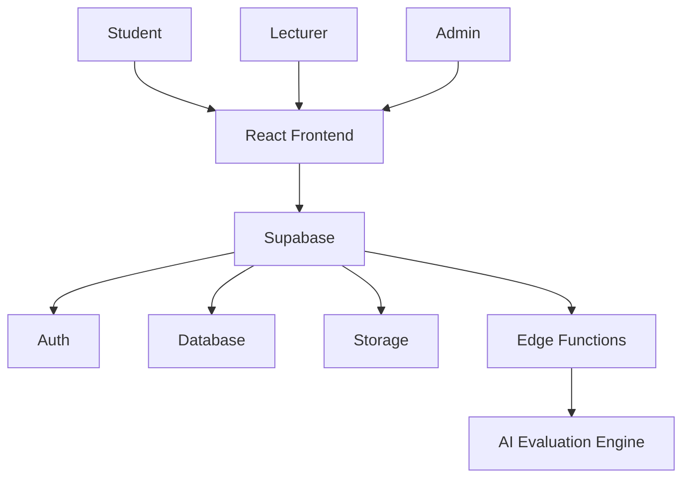

# GradeAI

[](https://github.com/Farukhsb/edu-intel-spark/actions/workflows/ci.yml)
[](https://codecov.io/gh/Farukhsb/edu-intel-spark)

Schools lose students in plain sight. Grades slip, submissions get missed, 
engagement drops and by the time someone notices, the window for early support 
has already closed.

GradeAI watches those signals continuously. It surfaces at-risk students to 
lecturers before the damage compounds, explains *why* each flag was raised, and 
tracks whether interventions actually worked.

Everything else AI-assisted grading, moderation workflows, academic integrity 
review, institutional reporting exists to feed better signals into that engine 
and keep educators in control of the decisions that follow.
## Live Demo

[Try the GradeAI demo](https://gradeai.pages.dev/)

## Table Of Contents

- [Quick Start](#quick-start)
- [Why GradeAI?](#why-gradeai)
- [Intended Users](#intended-users)
- [How To Use GradeAI](#how-to-use-gradeai)
- [Technical Highlights](#technical-highlights)
- [Features](#features)
- [Screenshots](#screenshots)
- [Architecture](#architecture)
- [Roadmap](#roadmap)
- [Contributing](#contributing)
- [Status](#status)
- [Evidence And Review Material](#evidence-and-review-material)

## Quick Start

### Prerequisites

- Node.js 20+
- npm
- Supabase project and keys

### Install

```bash
git clone https://github.com/Farukhsb/edu-intel-spark.git
cd edu-intel-spark
npm install
```

### Configure

Create a `.env.local` file with your Supabase values:

```env
VITE_SUPABASE_URL=https://your-project.supabase.co
VITE_SUPABASE_ANON_KEY=your-anon-key
```

### Run

```bash
npm run dev
```

Open `http://localhost:5173`.

## Why GradeAI?

Universities have more assessment work, more student support pressure, and less time to do both well.

GradeAI helps teams:

- reduce admin overhead
- spot at-risk students earlier
- keep human oversight on AI-assisted grading
- produce audit-friendly evidence for review and reporting

## Intended Users

- Universities
- Colleges
- Training providers
- Academic departments
- Course leaders
- Lecturers
- Student support teams

## How To Use GradeAI

### Lecturer workflow

1. Create an assignment
2. Upload a rubric
3. Open submissions
4. Review AI-generated grading
5. Approve feedback
6. Release grades

### Student workflow

1. Log in
2. View assignments
3. Submit work
4. Receive educator-approved feedback
5. Track improvement

### Administrator workflow

1. Open the institution dashboard
2. Monitor risk and moderation activity
3. Export reports
4. Review audit logs

## Technical Highlights

- Multi-tenant architecture
- Row-Level Security isolation
- AI-assisted assessment workflows
- Audit trail system
- Risk prediction engine
- Evidence export framework
- End-to-end CI/CD pipeline

## Screenshots

### Platform Overview

| Lecturer Dashboard | Risk Analytics |
| --- | --- |
|  |  |

| AI Grading | Student Plan |
| --- | --- |
|  |  |

## Features

- AI-assisted grading
- Student risk prediction
- Moderation workflows
- Multi-tenant architecture
- Audit logging
- Institutional reporting
- Evidence export
- Role-based access control
- Learning analytics dashboards

## Built With

- React
- TypeScript
- Supabase
- PostgreSQL
- Tailwind CSS
- Cloudflare Pages
- GitHub Actions

## Architecture



## Roadmap

### Current

- pilot validation
- security hardening
- risk model evaluation

### Planned

- LMS integrations
- more analytics
- institutional onboarding
- model benchmarking
- explainability improvements

## Contributing

Contributions are welcome.

1. Fork the repository
2. Create a branch
3. Make your changes
4. Open a pull request

## Status

GradeAI is a working pilot, not a finished institutional rollout.

- live and demo routes are separated
- the tests focus on safety boundaries as well as features
- demo routes use synthetic data only

## Evidence And Review Material

- [Architecture](docs/ARCHITECTURE.md)
- [Security Model](docs/SECURITY_MODEL.md)
- [Pilot Status](docs/PILOT_STATUS.md)
- [Model Evaluation](docs/MODEL_EVALUATION.md)
- [Risk Model Transparency](docs/risk-model-transparency.md)
- [Screenshots](docs/screenshots/README.md)

### Selected screenshot evidence

- [lecturer dashboard overview](docs/screenshots/lecturer-dashboard-overview.jpg)
- [overview dashboard](docs/screenshots/overview-dashboard.jpg)
- [cohort analytics dashboard](docs/screenshots/cohort-analytics-dashboard.jpg)
- [grade distribution analytics](docs/screenshots/grade-distribution-analytics.jpg)
- [predictive risk analytics](docs/screenshots/predictive-risk-analytics.jpg)
- [student improvement plan](docs/screenshots/student-improvement-plan.jpg)
- [AI grade explanation](docs/screenshots/ai-grade-explanation.jpg)

### Review path

1. [Architecture](docs/ARCHITECTURE.md)
2. [Security Model](docs/SECURITY_MODEL.md)
3. [Pilot Status](docs/PILOT_STATUS.md)
4. [Model Evaluation](docs/MODEL_EVALUATION.md)
5. [Screenshots](docs/screenshots/README.md)
