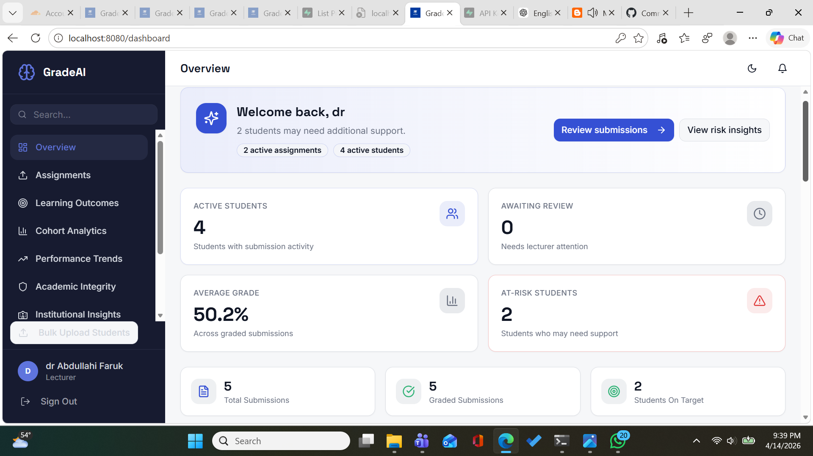
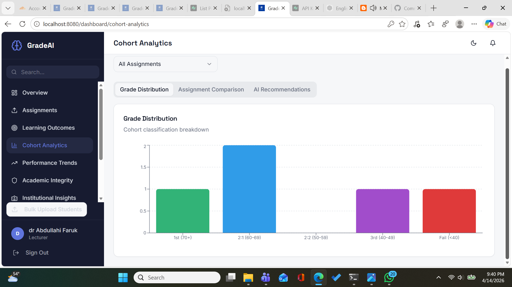
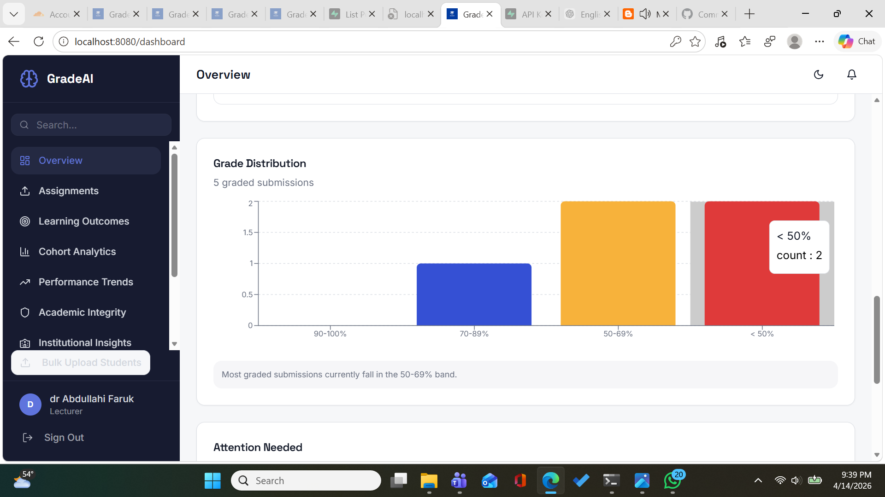
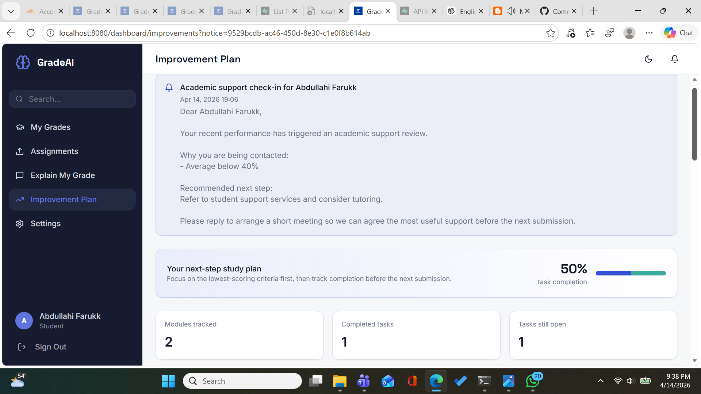
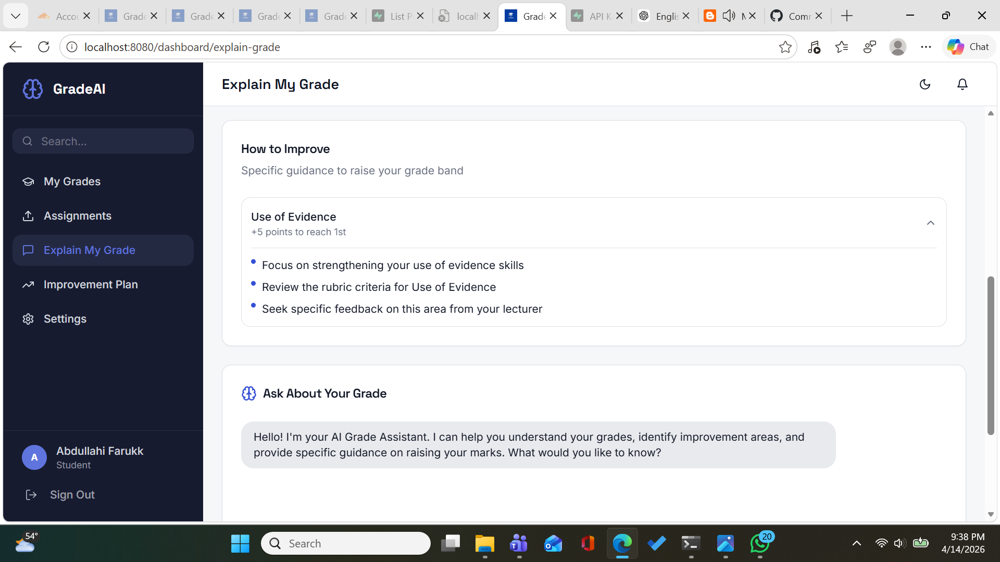

# GradeAI

GradeAI was built to reduce the time lecturers spend marking assignments while improving consistency, transparency, and reviewability.

Instead of replacing academic judgement, it supports it.

The system breaks marking into structured steps:
- rubric-based scoring
- evidence-backed feedback
- integrity signals
- lecturer review before approval and release

Live deployment:
- `https://gradeai.pages.dev`

The project is designed around the full assessment workflow rather than a single AI scoring feature. A lecturer can move from assignment setup, to grading, to moderation, to release, with the system keeping the process structured and inspectable.

## Why We Built It

Marking large numbers of submissions is repetitive, time-consuming, and often difficult to audit afterwards.

Most tools either focus only on grading speed or treat AI output like a black box. That creates trust problems. GradeAI takes a different approach: it keeps lecturers in control and makes the grading path visible.

## How It Works

At a high level:

```text
submission
  -> extraction
  -> rubric-based grading
  -> validation and fairness checks
  -> lecturer review
  -> approval
  -> release
```

The same principle applies to integrity review. Similarity signals, structural document artefacts, and AI-writing indicators are separated so the output is easier to interpret.

## Platform Preview

Here are a few real views from the product as it works today.

### Lecturer overview



### Analytics and insight





### Student support and explainability





## Key Features

- rubric-based assignment authoring
- student submission and secure file access
- AI-assisted grading with criterion-level scoring and confidence signals
- lecturer review, approval, and release controls
- citation-aware academic integrity analysis
- moderation workflows with audit history
- cohort analytics and explainable recommendations
- student risk tracking and intervention logging
- student-facing feedback, improvement plans, and AI tutoring
In practice, that means a lecturer can move from creating an assignment, to grading, to moderation, to release, to cohort-level reflection without leaving the platform.

## Workflow Snapshot

Main grading lifecycle:

```text
submitted
  -> ai_grading
  -> ai_graded
  -> first_review / under_review
  -> approved
  -> released
```

Moderated work can move through:

```text
first_review
  -> moderation_pending
  -> moderation_in_progress
  -> moderated / escalated
  -> approved
  -> released
```

This means:
- students never see provisional AI output
- lecturer review remains the decision point before approval
- moderated work is gated before release
- release is still an explicit action

## Key Product Areas

### Lecturer workspace

Lecturers can:
- create assignments with weighted rubrics
- upload or review submissions
- run AI grading and integrity checks
- edit marks and feedback before approval
- manage moderation cases
- review cohort analytics and recommendations
- log student interventions and follow-up actions

### Student workspace

Students can:
- submit work for open assignments
- view only released grades
- read lecturer-approved feedback
- use the Socratic AI tutor to understand their performance
- track improvement-plan progress

### Institutional workflows

GradeAI also supports:
- an admin control surface for user oversight and system-level reporting
- accreditation reporting views
- external examiner export workflows
- moderation and audit trails
- cohort-level quality and performance insight

## Integrity And Moderation

### Citation-aware integrity review

The integrity layer no longer treats all matched text equally.

It now distinguishes between:
- cited overlap
- uncited overlap
- reference sections

Reference sections such as `References`, `Bibliography`, and `Works Cited` are excluded from scoring. Quoted or cited material is still shown to lecturers, but it is labelled clearly as lower-risk cited material rather than being treated the same way as uncited copying.

Overlap is split into:
- `total_overlap`
- `cited_overlap`
- `uncited_overlap`
- `internal_peer_overlap`
- `external_source_overlap`

### PDF extraction quality

The integrity pipeline checks extraction quality before similarity analysis. If a PDF is dominated by object streams, metadata, or unreadable artefacts, the result is marked as **analysis limited** instead of being presented as a normal low-risk result.

### Moderation

Moderation is additive to grading, not a replacement for it. The platform supports:
- moderation case creation
- moderator assignment
- agree, adjust, return, escalate, and approve actions
- final agreed score recording
- audit history for grade changes and moderation decisions

## Cohort Analytics

The analytics layer includes:
- grade distribution
- assignment comparison
- performance trends
- student risk clustering
- integrity signal monitoring

It also includes deterministic AI Recommendations for lecturers. These recommendations are explainable rule-based cards derived from real analytics data, not black-box predictions.

Examples include:
- low cohort average
- high failure rate
- significant score drop between assignments
- weak rubric criteria
- high-risk student clusters
- integrity spikes

The intention is to support lecturer judgement with signals and context, not to hide decisions behind opaque scoring.

## Technology Stack

| Layer | Technology |
|---|---|
| Frontend | React 18, TypeScript, Vite |
| UI | Tailwind CSS, shadcn/ui, lucide-react |
| Backend | Supabase |
| Auth | Supabase Auth |
| Storage | Supabase Storage |
| Server logic | Supabase Edge Functions |
| Charts | Recharts |
| Product analytics | PostHog |
| Hosting | Cloudflare Pages |
| Testing | Vitest, Testing Library, Playwright |

## Technical Summary

For a short one-page technical overview, see [TECHNICAL_SUMMARY.md](TECHNICAL_SUMMARY.md).

## Project Structure

```text
src/
  components/         Shared application components
  components/ui/      UI primitives
  contexts/           App-level state and auth
  integrations/       Supabase client and generated types
  lib/                Shared workflow, analytics, and persistence logic
  pages/
    dashboard/        Lecturer and student dashboard pages
  test/               Unit and integration tests

tests/
  e2e/                Playwright browser coverage

supabase/
  functions/          Edge Functions for grading, integrity, and tutoring
  migrations/         Database schema and policy history
```

## Local Development

### 1. Install dependencies

```bash
npm install
```

### 2. Configure environment variables

Create a local `.env` file with your Supabase project values:

```env
VITE_SUPABASE_PROJECT_ID="your_project_ref"
VITE_SUPABASE_PUBLISHABLE_KEY="your_publishable_key"
VITE_SUPABASE_URL="https://your_project_ref.supabase.co"
```

Do not commit local environment files.

### 3. Start the app

```bash
npm run dev
```

## Testing

Run unit and integration tests:

```bash
npm run test
```

Run a production build check:

```bash
npm run build
```

Run Playwright browser tests:

```bash
npx playwright install
npm run test:e2e
```

Current browser-level coverage includes:
- lecturer review -> approve -> release
- moderation gating before approval
- student visibility boundaries for approved vs released grades
- academic integrity smoke flow for reviewing and saving a decision

Live browser verification has also been completed on the deployed environment for the core lecturer and student flows, so the current branch is no longer relying only on local or mocked confidence.

## Operational Checklists

For final verification and presentation readiness, use:
- [Release Readiness Checklist](C:/Users/a3dullahi/edu-intel-spark/docs/RELEASE_READINESS_CHECKLIST.md)
- [Live Role-Boundary Smoke Checklist](C:/Users/a3dullahi/edu-intel-spark/docs/LIVE_ROLE_BOUNDARY_SMOKE.md)

## Supabase And Migrations

This repo expects schema, policy, and RPC changes to be tracked in `supabase/migrations/`.

If you pull new schema changes, apply them manually against the linked project:

```bash
npx supabase db push --linked --include-all
```

Or run the relevant SQL migrations in Supabase SQL Editor.

High-trust workflows in this repo depend on the database layer, not just the UI. That includes:
- RLS policies
- recommendation action RPCs
- moderation tables
- audit logging triggers
- integrity review constraints

If the app layer and database layer drift apart, the trust boundary becomes weaker very quickly. That is why schema, policies, and workflow RPCs are treated as part of the product, not just backend plumbing.

## Migration History Note

This project contains two legacy short-form migration versions in Supabase metadata:

- 20260412  
- 20260413  

These correspond to:

- 20260412_fix_multi_tenant_rls.sql  
- 20260413_create_student_interventions.sql  

All migrations have been successfully applied in the live project, and the database is functioning correctly.

However, Supabase CLI may display these entries as “unmatched” due to earlier naming inconsistencies in migration IDs. This is a metadata alignment issue in the migration history, not a schema or permissions failure.

Important:
- Do not rename or modify historical migration IDs on a live project without a deliberate migration-history reconciliation plan.
- Treat this as a migration ledger hygiene issue only.

No action is required for normal operation.

### Current role-model note

The role model is a lot clearer than it was earlier in the project, but it still deserves a quick explanation.

- `admin` is now part of the real database role model
- public signup is hardened so it cannot create admin users
- the app is moving toward `user_roles` as the real authorization source, with `profiles.role` still mirrored for compatibility in some UI paths

So if you touch auth, routing, Edge Function checks, or RLS, check the full role path end to end rather than assuming the frontend alone tells the whole story.

## Important Edge Functions

The current backend uses these Supabase Edge Functions:
- `grade-submission`
- `check-plagiarism`
- `explain-grade`
- `bulk-create-students`

## Deployment Notes

- Frontend deploys to Cloudflare Pages
- Backend services run through Supabase
- Environment variables and Supabase secrets must match the target environment
- Edge Functions should be deployed when function code changes:

```bash
npx supabase functions deploy grade-submission
npx supabase functions deploy check-plagiarism
```

## Recent Improvements

A few areas of the platform were tightened up recently to make the product feel more reliable in day-to-day use.

- moderation permissions were aligned between local and hosted policy state, and the moderation workflow was rechecked against the current migration chain
- moderation UI coverage now includes nullable fallback cases, so missing linked submission data is handled explicitly and tested
- route-level lazy loading was improved to reduce the main frontend bundle
- export and chart-heavy vendor buckets were split more conservatively, so those libraries load closer to the routes and actions that actually use them
- React Router future flags were enabled early to remove upgrade warnings and keep the app closer to upcoming router behavior
- the role model was tightened so admin is part of the real schema, generated types were brought back in line, and public signup no longer trusts admin role input
- the admin area now includes read-only oversight views for users, assignments, submissions, reporting, and system-level navigation without forcing admin through lecturer-heavy pages

## Current State

This project is best described as a fast-moving integrated prototype with hardened core workflows. It is no longer just a UI demo, but it is also not pretending to be a fully finished institutional platform.

The strongest areas are:
- coherent assessment workflow design
- lecturer oversight and explainability
- moderation and audit direction
- integrity pipeline improvements
- growing automated coverage around critical flows
- successful live verification of the core deployed workflows

The main work still worth doing is operational hardening:
- more live-environment verification
- broader permissions and RLS validation after migration apply
- continued extraction of heavy page logic into smaller domain services
