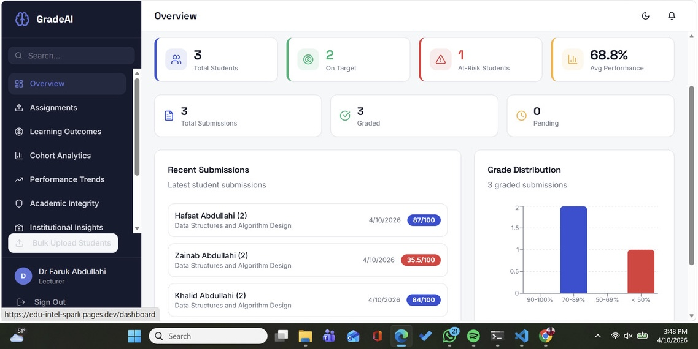
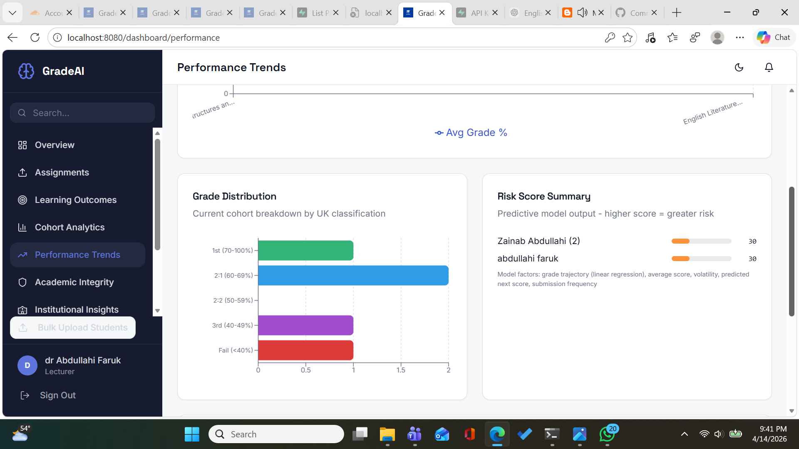

# GradeAI Lecturer Guide

## Purpose

GradeAI is an academic workflow platform designed to help lecturers manage the marking cycle in one place. It supports:

- assignment creation and rubric setup
- student submission handling
- AI-assisted grading with lecturer review
- academic integrity checking
- release of reviewed grades
- early support signals and intervention tracking

The goal is not to replace lecturer judgement. The goal is to reduce repetitive marking effort, surface useful evidence faster, and keep the final decision with the lecturer.

## Getting Access

Lecturer accounts should be created through the invite flow.

The usual process is:

1. An admin or authorised staff member adds the lecturer to GradeAI.
2. The lecturer receives an invitation email.
3. The lecturer opens the secure invite link.
4. The lecturer sets their password and signs in.
5. GradeAI routes the lecturer to the lecturer dashboard.

Avoid sharing passwords or sending account credentials in a separate file. The invite flow is easier to manage and gives a clearer onboarding trail.

If the invite email does not arrive, check spam/junk first, then ask the admin to resend the invite.

## What Lecturers Can Do

As a lecturer, you can use the platform to:

- create and publish assignments
- define rubric criteria for structured marking
- receive student submissions
- run AI grading against the rubric
- review, edit, approve, and release grades
- run similarity and AI-writing integrity checks
- review flagged integrity cases
- review students who may need support
- log interventions and send follow-up notifications

## How To Navigate The Website

The lecturer dashboard is organised around the main assessment workflow.

The sidebar is grouped like this:

- `Teaching`
  This is the day-to-day teaching workspace.
- `Assessment`
  This is where review and quality-control tasks live.
- `Teaching Insights`
  This is where you look at cohort patterns, performance movement, and outcome-level signals.
- `Workspace`
  This is where personal settings live.

The main lecturer pages are:

- `Overview`
  Use this to get a quick summary of submission activity, grading progress, and students who may need attention.
- `Assignments`
  Use this to create assignments, open a specific assignment, and manage submission workflows.
- `Academic Integrity`
  Use this to review persisted integrity cases after running checks from an assignment.
- `Moderation`
  Use this to review cases that need a second look before release.
- `Cohort Analytics`
  Use this to see trends and distributions across groups of students.
- `Performance Trends`
  Use this to track movement in grades over time and review early support signals.
- `Learning Outcomes`
  Use this to review assessment alignment and outcome visibility.
- `Settings`
  Use this for account and system-level preferences.

Institution-level reporting pages such as `Institutional Insights`, `Accreditation`, and `External Examiner` now sit under the admin reporting area, not the lecturer sidebar.

## Recommended Lecturer Workflow

### 1. Create and Publish an Assignment

From `Assignments`:

- create a new assignment
- add title, description, module code, due date, and max score
- build the rubric with weighted criteria
- publish the assignment so students can submit

### 2. Wait for Student Submissions

Once students submit, their work appears inside the assignment detail view. Lecturers can:

- open submitted files
- select one or more submissions
- review current workflow status

### 3. Run Integrity Checks

From the assignment page:

- run `Check plagiarism`

This checks:

- similarity between student submissions in the same assignment
- AI-writing suspicion indicators within a submission

The result is stored and later appears in the `Academic Integrity` queue for lecturer review.

### 4. Run AI Grading

From the same assignment page:

- select submitted work
- run `AI grade`

The system grades against the rubric and returns:

- a score
- written feedback
- per-criterion breakdown

### 5. Review and Approve

After AI grading:

- open the submission review
- adjust score or feedback if needed
- approve the result when satisfied

### 6. Release Grades

When review is complete:

- release grades to students

Students can then view:

- their released score
- feedback
- rubric breakdown

### 7. Monitor Support Needs and Follow Up

Use the student profile and improvement workflow to:

- review students whose assessment patterns suggest they may benefit from extra support
- log interventions
- send support notifications and follow-up reminders
- review improvement-plan progress

## Key Screens

### Lecturer Dashboard Overview

This is the main starting point for lecturers.

### Main Dashboard View

This shows the broader working environment used across lecturer workflows.

### Cohort Analytics

Use this to review overall patterns across groups of students.

### Grade Distribution Analytics

Use this to understand how marks are distributed across the cohort.

### Early Support Signals

Use this to review students whose assessment patterns suggest they may benefit from extra support.

## Important Notes For Lecturers

- AI grading is decision support, not final academic judgement.
- Integrity analysis is evidence support, not proof of misconduct.
- Early support signals are prompts for lecturer review, not automatic labels about students.
- Final review and release decisions should remain with the lecturer.
- The integrity review queue shows persisted results. To refresh integrity evidence, run the integrity check again from the assignment page.

## Best Practice

For the best results:

- create clear rubrics before grading
- run integrity checks before final release
- review AI feedback before approving grades
- use intervention tracking where a student may need extra support
- keep follow-up actions documented in the platform

## Short Summary

GradeAI helps lecturers move from assignment setup to grading, integrity review, release, and student support in one connected workflow. It is designed to save time, improve consistency, and keep lecturers in control of final academic decisions.
